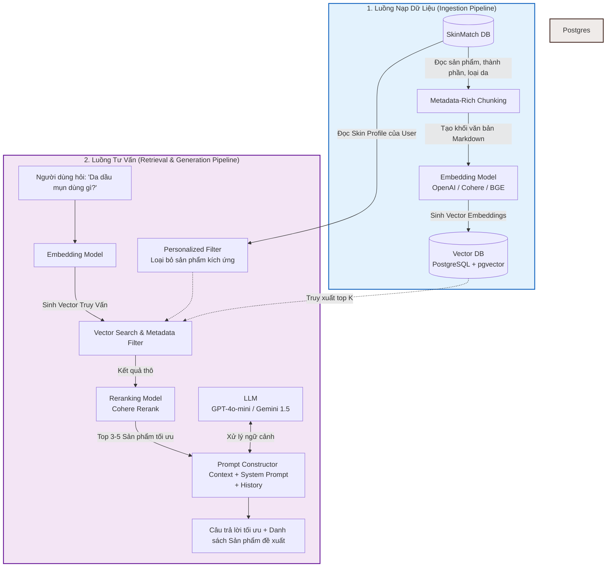
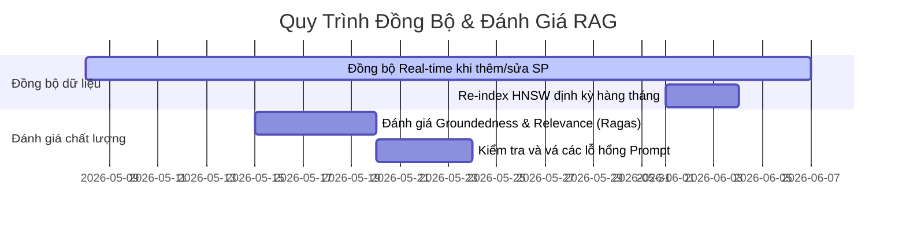

# QUY TRÌNH TRIỂN KHAI CHATBOT TƯ VẤN MỸ PHẨM SỬ DỤNG RAG (RETRIEVAL-AUGMENTED GENERATION) CHO SKINMATCH

Tài liệu này hướng dẫn chi tiết quy trình xây dựng, triển khai và tích hợp hệ thống **AI Chatbot tư vấn da liễu và gợi ý mỹ phẩm** dựa trên kiến trúc **RAG (Retrieval-Augmented Generation)**. Hệ thống được thiết kế tối ưu hóa cho hệ sinh thái hiện tại của **SkinMatch** bao gồm **NestJS**, **Prisma ORM** và cơ sở dữ liệu **PostgreSQL**.

---

## 1. Giới Thiệu Tổng Quan & Tại Sao Lại Là RAG?

Đối với một ứng dụng tư vấn mỹ phẩm như **SkinMatch**, việc AI cung cấp thông tin sai lệch (Hallucination - ảo tưởng) về thành phần, công dụng hoặc gợi ý sai sản phẩm cho một loại da nhạy cảm có thể gây ra hậu quả nghiêm trọng cho người dùng. 

**RAG (Retrieval-Augmented Generation)** giải quyết triệt để vấn đề này bằng cách:
*   **Tránh ảo tưởng thông tin:** Thay vì để LLM tự "nhớ" kiến thức, hệ thống sẽ tìm kiếm thông tin chính xác từ cơ sở dữ liệu sản phẩm của SkinMatch trước, sau đó cung cấp tài liệu này làm ngữ cảnh (Context) cho LLM tổng hợp câu trả lời.
*   **Cập nhật thời gian thực:** Ngay khi dữ liệu sản phẩm, giá bán, hoặc trạng thái kho hàng thay đổi trong Database, Chatbot sẽ cập nhật thông tin tư vấn ngay lập tức mà không cần training lại mô hình.
*   **Cá nhân hóa sâu sắc:** Cho phép kết hợp hồ sơ loại da của khách hàng (`skin_profiles`) từ Database để lọc các sản phẩm phù hợp nhất, nâng cao trải nghiệm mua sắm.

---

## 2. Kiến Trúc Hệ Thống (Architecture Diagram)

Hệ thống RAG của SkinMatch được chia làm hai luồng xử lý chính:
1.  **Ingestion Pipeline (Luồng nạp dữ liệu):** Đồng bộ hóa sản phẩm từ Database thường sang Vector Database dưới dạng nhúng vector (Embeddings).
2.  **Retrieval & Generation Pipeline (Luồng truy vấn & sinh phản hồi):** Nhận câu hỏi từ User, truy xuất thông tin liên quan từ Vector DB, kết hợp thông tin hồ sơ da của user, và dùng LLM sinh ra câu trả lời cuối cùng.



---

## 3. Các Bước Triển Khai Chi Tiết (Phase-by-Phase Process)

### Phase 1: Chuẩn Bị & Chunking Dữ Liệu (Data Preparation & Ingestion)

Để mô hình tìm kiếm ngữ nghĩa hoạt động hiệu quả, chúng ta cần chuyển đổi cơ sở dữ liệu quan hệ phức tạp thành các khối văn bản (chunks) mạch lạc, giàu ngữ cảnh. 

#### 1. Trích xuất dữ liệu quan hệ (ETL)
Với mỗi sản phẩm trong bảng `products`, ta cần lấy thông tin chi tiết và kéo thông tin phân loại liên quan:
*   `products` (tên, mô tả, tóm tắt, cách dùng, và danh sách thành phần đầy đủ trong trường **`ingredient_full_text`**).
*   `categories` (danh mục).
*   `skin_types` (loại da phù hợp).
*   `concerns` (vấn đề da giải quyết).

> [!NOTE]
> Hệ thống **KHÔNG** cần truy xuất liên kết Many-to-Many với bảng `ingredients` hay `product_ingredients`. Việc sử dụng trực tiếp cột `ingredient_full_text` trong bảng `products` giúp đơn giản hóa đáng kể câu lệnh truy vấn SQL, giảm tải bộ nhớ và giữ nguyên định dạng danh sách thành phần chuẩn của nhà sản xuất.

#### 2. Kỹ thuật "Metadata-Rich Multi-Chunking" (Tách nhỏ từng phần)
Thay vì cắt nhỏ mô tả sản phẩm bằng các bộ cắt văn bản tự động (như RecursiveCharacterTextSplitter) dễ làm đứt gãy ngữ nghĩa, chúng ta áp dụng kỹ thuật **chia nhỏ có cấu trúc (Semantic Multi-Chunking)**. 

Mỗi sản phẩm hoạt động sẽ được tự động tách ra tối đa **3 chunks độc lập** (và lưu trữ theo quan hệ **One-to-Many** trong bảng `product_embeddings`):

##### Chunk 1: Tổng quan & Phân loại (chunk_type: "general")
```markdown
ID Sản Phẩm: 104
Tên Sản Phẩm: Serum B5 La Roche-Posay Hyalu B5
Danh mục: Serum / Tinh chất phục hồi
Tóm tắt (summary): Tinh chất phục hồi da chuyên sâu.
Loại da phù hợp: Da nhạy cảm, Da khô, Da thường, Da dầu thiếu nước.
Giải quyết vấn đề da: Da kích ứng, Da sau điều trị (treatment), Da có nếp nhăn mảnh.
```

##### Chunk 2: Mô tả chi tiết (chunk_type: "description") - Chỉ tạo nếu có nội dung
```markdown
ID Sản Phẩm: 104
Tên Sản Phẩm: Serum B5 La Roche-Posay Hyalu B5
Mô tả chi tiết (description): Tinh chất Hyalu B5 giúp hỗ trợ tái tạo, phục hồi hàng rào bảo vệ da nhạy cảm cực kỳ hiệu quả. Công thức chứa các hạt dưỡng chất siêu nhỏ thẩm thấu nhanh giúp làm dịu da bị kích ứng tức thì, tăng cường độ đàn hồi, làm mờ nếp nhăn mảnh, đồng thời khóa ẩm sâu giúp bề mặt da căng mướt suốt 24 giờ...
```

##### Chunk 3: Cách dùng & Thành phần (chunk_type: "usage_ingredients") - Chỉ tạo nếu có nội dung
```markdown
ID Sản Phẩm: 104
Tên Sản Phẩm: Serum B5 La Roche-Posay Hyalu B5
Cách dùng (usage_instructions): Sử dụng 3-4 giọt thoa đều toàn mặt vào buổi sáng và/hoặc tối sau bước làm sạch và toner.
Thành phần đầy đủ (ingredient_full_text): Aqua, Glycerin, Alcohol Denat, Propylene Glycol, Panthenol, Pentylene Glycol, Dimethicone, Madecassoside, Sodium Hyaluronate, Tocopherol...
```

**Metadata lưu kèm cho mỗi Chunk (dùng để Filter cứng):**
```json
{
  "product_id": 104,
  "slug": "serum-b5-la-roche-posay-hyalu-b5",
  "is_active": true,
  "category_ids": [12],
  "suitable_skin_types": [1, 3, 4],
  "suitable_concerns": [2, 5]
}
```

---

### Phase 2: Vectorization & Lưu Trữ Vector DB (PostgreSQL + pgvector)

Vì dự án SkinMatch đang sử dụng **PostgreSQL** và **Prisma**, giải pháp kiến trúc tối ưu nhất là sử dụng extension **`pgvector`** ngay trên cơ sở dữ liệu hiện tại.

#### Lợi ích vượt trội của pgvector:
1.  **Không phát sinh chi phí vận hành:** Không cần phải thuê thêm bên thứ ba như Pinecone hay Qdrant.
2.  **Đảm bảo tính nhất quán dữ liệu (ACID):** Khi xóa một sản phẩm trong bảng `products`, trigger hoặc Prisma cascade sẽ tự động xóa vector nhúng tương ứng trong bảng vector.
3.  **Hỗ trợ Hybrid Query:** Có thể dễ dàng viết một câu lệnh SQL kết hợp điều kiện `WHERE price <= 500000` (dữ liệu quan hệ) và khoảng cách vector `<->` (tìm kiếm ngữ nghĩa).

#### Cấu hình pgvector với Prisma:

##### Bước 1: Kích hoạt extension trong PostgreSQL
Chạy câu lệnh SQL sau trong PostgreSQL của bạn:
```sql
CREATE EXTENSION IF NOT EXISTS vector;
```

##### Bước 2: Khai báo bảng lưu trữ Vector trong `schema.prisma`
```prisma
// Thêm mô hình lưu trữ vector nhúng cho sản phẩm
model product_embeddings {
  id           Int      @id @default(autoincrement())
  product_id   Int      @unique
  chunk_text   String   @db.Text
  metadata     Json
  // Trường vector đặc biệt (ví dụ độ rộng 1536 đối với text-embedding-3-small)
  // Lưu ý: Prisma hiện tại chưa hỗ trợ kiểu 'Unsupported("vector(1536)")' hoàn chỉnh trong di trú tự động, 
  // vì vậy chúng ta sẽ sử dụng kiểu Unsupported và tạo cột bằng Migration thô.
  embedding    Unsupported("vector(1536)")?
  
  products     products @relation(fields: [product_id], references: [id], onDelete: Cascade)
  
  @@index([embedding], map: "idx_product_embeddings_vector")
}
```

##### Bước 3: Tạo SQL Migration thô để tạo chỉ mục HNSW (Hierarchical Navigable Small World) để tìm kiếm nhanh
```sql
-- Tạo bảng
CREATE TABLE "product_embeddings" (
    "id" SERIAL NOT NULL,
    "product_id" INTEGER NOT NULL,
    "chunk_text" TEXT NOT NULL,
    "metadata" JSONB NOT NULL,
    "embedding" vector(1536),

    CONSTRAINT "product_embeddings_pkey" PRIMARY KEY ("id")
);

-- Tạo liên kết khóa ngoại
ALTER TABLE "product_embeddings" ADD CONSTRAINT "product_embeddings_product_id_fkey" FOREIGN KEY ("product_id") REFERENCES "products"("id") ON DELETE CASCADE ON UPDATE CASCADE;

-- Tạo chỉ mục HNSW sử dụng khoảng cách Cosine
CREATE INDEX idx_product_embeddings_hnsw ON "product_embeddings" USING hnsw (embedding vector_cosine_ops);
```

---

### Phase 3: Thuật Toán Tìm Kiếm & Cá Nhân Hóa (Retrieval & Hybrid Search)

Khi người dùng nhập câu hỏi: *"Mình bị mụn viêm và da rất đổ dầu, nên dùng kem chống nắng nào dưới 500k không gây bí da?"*

Hệ thống sẽ thực hiện các bước truy xuất sau để đảm bảo kết quả chính xác nhất:

| Bước thực hiện | Chi tiết kỹ thuật | Mục tiêu |
| :--- | :--- | :--- |
| **1. Trích xuất Thực thể & Phân tích** | Nhận diện: **Loại da:** Dầu, **Vấn đề:** Mụn viêm, **Mức giá:** < 500k, **Sản phẩm:** Kem chống nắng. | Hiểu ý định người dùng một cách chính xác. |
| **2. Cá nhân hóa theo Hồ sơ User** | Truy vấn bảng `skin_profiles` của người dùng (nếu đã đăng nhập). Ví dụ, nếu hồ sơ lưu là *Da nhạy cảm*, hệ thống sẽ tự động thêm bộ lọc loại bỏ các sản phẩm chứa cồn khô, hương liệu hoặc chất chống nắng hóa học dễ kích ứng. | Bảo vệ an toàn làn da khách hàng, tăng độ tin cậy. |
| **3. Truy vấn lai (Hybrid Search)** | **Vector Search:** Nhúng câu hỏi của user thành vector đại diện và so sánh cosine similarity với cột `embedding` trong `product_embeddings`. <br>**Keyword Search (FTS):** Tìm kiếm chính xác các từ khóa `"mụn viêm"`, `"kem chống nắng"`, `"kiềm dầu"` bằng PostgreSQL Full-Text Search. | Lấy ra danh sách thô (Top 15) vừa có độ liên quan ngữ nghĩa vừa chứa chính xác các từ khóa cần tìm. |
| **4. Reranking (Sắp xếp lại)** | Sử dụng mô hình **Cohere Rerank v3** gửi Top 15 kết quả thô kèm câu hỏi của user để chấm điểm và chọn ra **Top 5** sản phẩm có điểm tương thích thực tế cao nhất. | Đảm bảo sản phẩm tốt nhất và phù hợp nhất luôn hiển thị ở trên cùng. |

---

### Phase 4: Thiết Kế Prompt Tư Vấn Chuyên Nghiệp (Prompt Engineering)

Một System Prompt được thiết kế tốt sẽ giúp mô hình đóng vai một Chuyên gia Tư vấn Da liễu thực thụ của SkinMatch, đồng thời tuân thủ nghiêm ngặt các quy tắc an toàn y tế thẩm mỹ.

#### System Prompt đề xuất cho SkinMatch Chatbot:

```text
Bạn là "SkinMatch AI Expert" - Trợ lý và Chuyên gia tư vấn da liễu số một của nền tảng mỹ phẩm SkinMatch.
Nhiệm vụ của bạn là lắng nghe, phân tích tình trạng da của khách hàng và đưa ra giải pháp chăm sóc da khoa học, an toàn cùng các gợi ý sản phẩm phù hợp nhất.

HÃY TUÂN THỦ CÁC QUY TẮC SAU ĐÂY:
1. CHỈ SỬ DỤNG NGỮ CẢNH ĐƯỢC CUNG CẤP: Chỉ tư vấn và đề xuất các sản phẩm có thông tin cụ thể trong phần "Ngữ cảnh sản phẩm dưới đây". Tuyệt đối không tự ý bịa đặt thông tin sản phẩm, giá bán, hoặc giới thiệu các sản phẩm ngoài danh sách.
2. AN TOÀN LÀ TRÊN HẾT: 
   - Nếu khách hàng có da cực kỳ nhạy cảm, đang bị tổn thương nặng hoặc đang mang thai, hãy cảnh báo họ tránh xa các hoạt chất mạnh như Retinoids nồng độ cao, BHA nồng độ cao, hoặc Hydroquinone trừ khi có chỉ định bác sĩ.
   - Luôn khuyên người dùng test thử sản phẩm mới trên một vùng da nhỏ (phía sau tai hoặc quai hàm) trước khi thoa toàn mặt.
3. PHÂN TÍCH KHOA HỌC: Giải thích lý do tại sao sản phẩm đó lại phù hợp với loại da và vấn đề da của khách hàng bằng cách nêu bật các thành phần chính (Active Ingredients) có trong ngữ cảnh.
4. THÂN THIỆN VÀ CHUYÊN NGHIỆP: Giọng điệu của bạn cần ấm áp, ân cần, đáng tin cậy và chuyên nghiệp như một bác sĩ da liễu. Gọi người dùng là "bạn" và xưng "SkinMatch" hoặc "mình".

---
DƯỚI ĐÂY LÀ THÔNG TIN CHI TIẾT VỀ HỒ SƠ DA CỦA KHÁCH HÀNG (Nếu có):
- Loại da: {user_skin_type}
- Mức độ nhạy cảm: {user_sensitivity}
- Các vấn đề da đang gặp phải: {user_concerns}

---
NGỮ CẢNH SẢN PHẨM KHẢ DỤNG TRÊN SKINMATCH:
{retrieved_context}

---
LỊCH SỬ CUỘC TRÒ CHUYỆN:
{chat_history}
```

---

### Phase 5: Tích Hợp Backend NestJS (Implementation Blueprint)

Dưới đây là sơ đồ thư mục và mã nguồn mẫu cho Module Chatbot RAG sử dụng **NestJS** kết hợp trực tiếp với **Prisma Client** và thư viện **OpenAI / LangChain**.

#### Cấu trúc Module Chatbot:
```text
src/modules/chatbot/
├── chatbot.module.ts
├── chatbot.controller.ts
├── chatbot.service.ts
├── dto/
│   └── ask-chatbot.dto.ts
└── templates/
    └── prompt.template.ts
```

#### 1. DTO nhận câu hỏi từ Client (`ask-chatbot.dto.ts`)
```typescript
import { IsString, IsNotEmpty, IsOptional } from 'class-validator';

export class AskChatbotDto {
  @IsString()
  @IsNotEmpty()
  message: string;

  @IsOptional()
  @IsString()
  sessionId?: string; // Để lưu và khôi phục lịch sử chat của phiên làm việc
}
```

#### 2. Service xử lý nghiệp vụ chính (`chatbot.service.ts`)
```typescript
import { Injectable, InternalServerErrorException } from '@nestjs/common';
import { PrismaService } from 'src/shared/services/prisma.service'; // Đường dẫn PrismaService thực tế của dự án
import { AskChatbotDto } from './dto/ask-chatbot.dto';
import { OpenAIEmbeddings, ChatOpenAI } from '@langchain/openai';

@Injectable()
export class ChatbotService {
  private embeddingsModel: OpenAIEmbeddings;
  private chatModel: ChatOpenAI;

  constructor(private readonly prisma: PrismaService) {
    this.embeddingsModel = new OpenAIEmbeddings({
      openAIApiKey: process.env.OPENAI_API_KEY,
      modelName: 'text-embedding-3-small',
    });

    this.chatModel = new ChatOpenAI({
      openAIApiKey: process.env.OPENAI_API_KEY,
      modelName: 'gpt-4o-mini',
      temperature: 0.3, // Nhiệt độ thấp để chatbot trả lời chính xác, tránh sáng tạo bừa bãi
    });
  }

  /**
   * Phương thức xử lý câu hỏi của người dùng và trả về phản hồi RAG
   */
  async ask(userId: number | null, dto: AskChatbotDto) {
    try {
      const { message, sessionId } = dto;

      // 1. Lấy thông tin hồ sơ da của người dùng (nếu đã đăng nhập)
      let skinProfileText = 'Không xác định (Khách vãng lai)';
      let skinTypeId: number | null = null;
      let sensitivity = 'Không rõ';

      if (userId) {
        const profile = await this.prisma.skin_profiles.findUnique({
          where: { user_id: userId },
          include: { skin_types: true },
        });
        if (profile) {
          skinTypeId = profile.skin_type_id;
          sensitivity = profile.sensitivity || 'Trung bình';
          skinProfileText = `Loại da: ${profile.skin_types?.name || 'Chưa cập nhật'}, Độ nhạy cảm: ${sensitivity}`;
        }
      }

      // 2. Chuyển đổi câu hỏi của user thành Vector Embedding
      const queryVector = await this.embeddingsModel.embedQuery(message);
      const vectorSqlStr = `[${queryVector.join(',')}]`;

      // 3. Thực hiện Vector Similarity Search trên PostgreSQL kết hợp lọc điều kiện cứng
      // Ta sử dụng Raw SQL của Prisma để thực hiện toán tử khoảng cách cosine <=> của pgvector
      let query = `
        SELECT 
          pe.product_id, 
          pe.chunk_text,
          (pe.embedding <=> '${vectorSqlStr}'::vector) as distance
        FROM product_embeddings pe
        INNER JOIN products p ON pe.product_id = p.id
        WHERE p.is_active = true
      `;

      // Ví dụ lọc nâng cao: Nếu da người dùng cực kỳ nhạy cảm, loại bỏ các sản phẩm không phù hợp nhạy cảm
      if (sensitivity.toLowerCase() === 'nhạy cảm' || sensitivity.toLowerCase() === 'rất nhạy cảm') {
        // Thực hiện join thêm điều kiện lọc sản phẩm lành tính dựa trên bảng product_skin_types
        // (Hoặc lọc thông qua trường metadata JSONB của product_embeddings)
        query += ` AND (pe.metadata->'suitable_skin_types')::jsonb @> '[4]'`; // Giả định ID 4 là da nhạy cảm
      }

      query += ` ORDER BY distance ASC LIMIT 5;`;

      const matchedChunks: any[] = await this.prisma.$queryRawUnsafe(query);

      // 4. Định dạng Context từ các khối dữ liệu trùng khớp nhất
      const context = matchedChunks
        .map((chunk, idx) => `[Sản phẩm ${idx + 1}]:\n${chunk.chunk_text}\n---`)
        .join('\n\n');

      // 5. Khôi phục lịch sử trò chuyện (Ví dụ từ database hoặc redis cache)
      const chatHistory = await this.getChatHistory(sessionId || 'default');

      // 6. Xây dựng Prompt hoàn chỉnh
      const systemPrompt = `
Bạn là "SkinMatch AI Expert" - Trợ lý và Chuyên gia tư vấn da liễu số một của nền tảng mỹ phẩm SkinMatch.
Hãy phân tích tình trạng da của khách hàng và đưa ra giải pháp chăm sóc da khoa học, an toàn kèm các gợi ý sản phẩm phù hợp nhất.

CHỈ SỬ DỤNG NGỮ CẢNH DƯỚI ĐÂY ĐỂ ĐỀ XUẤT SẢN PHẨM:
${context}

THÔNG TIN HỒ SƠ DA NGƯỜI DÙNG:
- ${skinProfileText}

QUY TẮC AN TOÀN: 
- Luôn khuyên khách hàng test sản phẩm trên vùng da nhỏ trước khi sử dụng toàn mặt.
- Không tư vấn sản phẩm ngoài danh bạ ngữ cảnh cung cấp ở trên.
      `;

      // 7. Gọi LLM sinh phản hồi
      const response = await this.chatModel.invoke([
        { role: 'system', content: systemPrompt },
        ...chatHistory,
        { role: 'user', content: message }
      ]);

      const replyContent = response.content;

      // 8. Lưu cuộc trò chuyện vào Lịch sử (Để phục vụ các lượt chat tiếp theo)
      await this.saveChatMessage(sessionId || 'default', message, replyContent);

      // 9. Đồng thời ghi lại hành vi của người dùng để phân tích về sau
      if (userId) {
        await this.prisma.user_behaviors.create({
          data: {
            user_id: userId,
            action: 'ask_chatbot',
            // Có thể mở rộng lưu trữ log câu hỏi của user
          }
        });
      }

      return {
        answer: replyContent,
        suggestedProducts: matchedChunks.map(c => ({
          productId: c.product_id,
          confidenceScore: (1 - c.distance).toFixed(2), // Chuyển đổi khoảng cách thành điểm tin cậy
        }))
      };

    } catch (error) {
      console.error('Error in ChatbotService.ask:', error);
      throw new InternalServerErrorException('Có lỗi xảy ra trong quá trình xử lý của Chatbot.');
    }
  }

  private async getChatHistory(sessionId: string): Promise<any[]> {
    // Logic lấy lịch sử chat từ Redis hoặc database. 
    // Trả về mảng rỗng nếu là phiên chat mới.
    return [];
  }

  private async saveChatMessage(sessionId: string, userMsg: string, aiMsg: string): Promise<void> {
    // Logic lưu trữ tin nhắn phục vụ ghi nhớ ngữ cảnh cuộc trò chuyện.
  }
}
```

---

## 4. Quy Trình Vận Hành & Bảo Trì Hệ Thống RAG

Để chatbot luôn hoạt động với hiệu suất cao và thông tin chính xác nhất, đội ngũ vận hành cần thực hiện các quy trình bảo trì định kỳ sau:



### 1. Đồng bộ hóa Vector dữ liệu (Sync Pipeline)
*   **Real-time Trigger:** Mỗi khi Admin thêm mới hoặc chỉnh sửa một sản phẩm trong Admin Dashboard, NestJS sẽ phát ra một `ProductUpdatedEvent`. Service lắng nghe sự kiện này sẽ tự động tái cấu trúc Chunk văn bản, gọi OpenAI Embedding API để cập nhật lại vector nhúng trong bảng `product_embeddings`.
*   **Batch Update:** Mỗi tuần một lần, chạy một Cron Job rà soát toàn bộ bảng `products` để đồng bộ lại, đảm bảo không có sản phẩm nào bị sót hoặc sai lệch trạng thái vector.

### 2. Đánh giá chất lượng Chatbot (Evaluation & Observability)
*   Sử dụng framework **Ragas** để chạy kiểm thử định kỳ trên tập câu hỏi mẫu (Golden Dataset). Đo lường 3 chỉ số vàng:
    1.  **Faithfulness (Độ trung thực):** Kiểm tra xem câu trả lời của AI có hoàn toàn dựa vào ngữ cảnh được cung cấp hay tự bịa ra thông tin.
    2.  **Answer Relevance (Độ liên quan):** Đánh giá xem câu trả lời có giải quyết đúng thắc mắc của người dùng hay không.
    3.  **Context Precision (Độ chính xác của ngữ cảnh):** Đo lường xem hệ thống Vector Search có lấy đúng các sản phẩm liên quan nhất đến câu hỏi không.
*   **User Feedback Loop:** Hiển thị nút Thumbs Up / Thumbs Down ở mỗi câu trả lời của Chatbot. Toàn bộ lượt đánh giá tiêu cực (Thumbs Down) sẽ được lưu lại để kỹ sư AI rà soát, tinh chỉnh Prompt hoặc cải tiến kỹ thuật Chunking dữ liệu.
